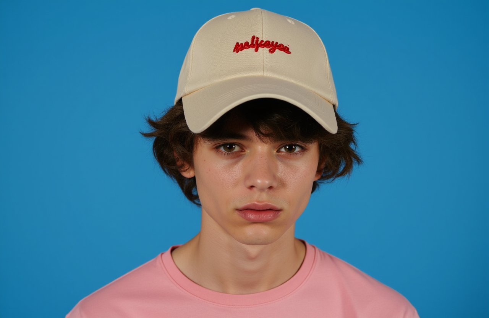

# Model description for Flux-Super-Portrait-LoRA


## Image Gallery

<p align="center">
  
  
  
</p>
<p align="center">
  
  
  
</p>


Image Processing Parameters 

| Parameter                 | Value  | Parameter                 | Value  |
|---------------------------|--------|---------------------------|--------|
| LR Scheduler              | constant | Noise Offset              | 0.03   |
| Optimizer                 | AdamW  | Multires Noise Discount   | 0.1    |
| Network Dim               | 64     | Multires Noise Iterations | 10     |
| Network Alpha             | 32     | Repeat & Steps           | 17 & 2650 |
| Epoch                     | 14   | Save Every N Epochs       | 1     |

    Labeling: florence2-en(natural language & English)
    
    Total Images Used for Training : 19 [ Flat 4K ]

## Best Dimensions & Inference

| **Dimensions** | **Aspect Ratio** | **Recommendation**       |
|-----------------|------------------|---------------------------|
| 1280 x 832      | 3:2              | Best                     |
| 1024 x 1024     | 1:1              | Default                  |

### Inference Range

- **Recommended Inference Steps:** 30–35

## Setting Up
```python
import torch
from pipelines import DiffusionPipeline

base_model = "black-forest-labs/FLUX.1-dev"
pipe = DiffusionPipeline.from_pretrained(base_model, torch_dtype=torch.bfloat16)

lora_repo = "strangerzonehf/Flux-Super-Portrait-LoRA"
trigger_word = "Super Portrait"  
pipe.load_lora_weights(lora_repo)

device = torch.device("cuda")
pipe.to(device)
```
## Trigger words

You should use `Super Portrait` to trigger the image generation.

## Download model

Weights for this model are available in Safetensors format.

[Download](/strangerzonehf/Flux-Super-Portrait-LoRA/tree/main) them in the Files & versions tab.
